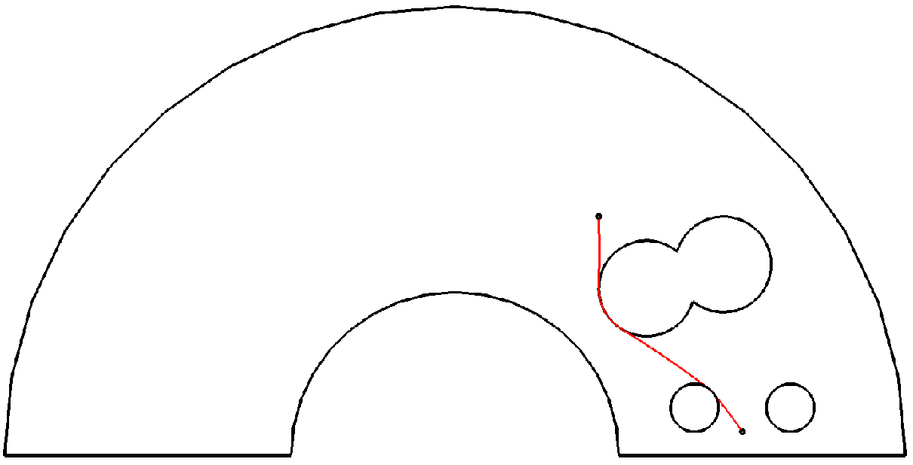
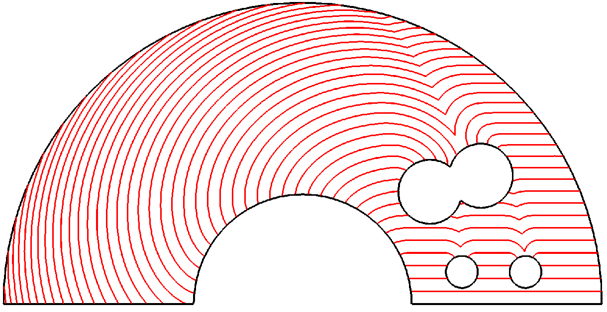
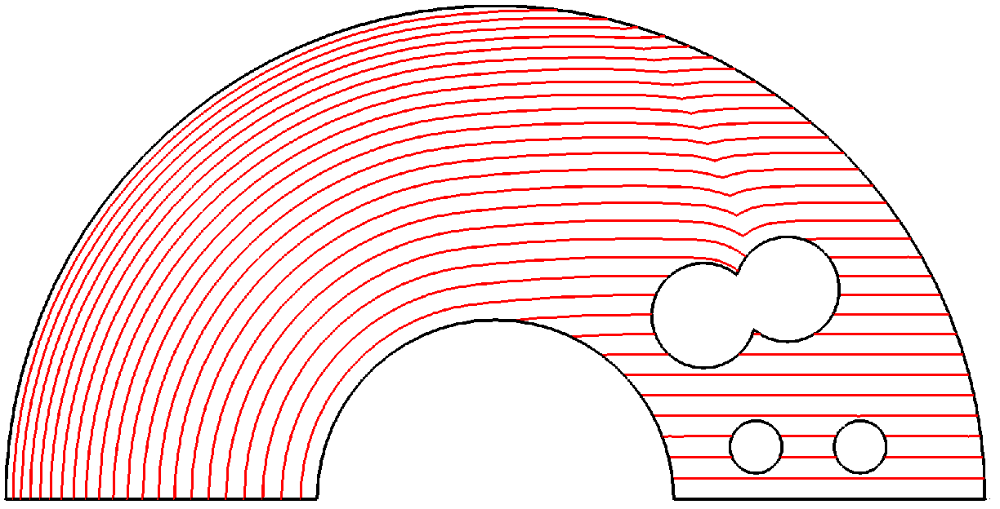

#     CAM Library User's Guide

<h1><a id="products_user_guides__cam_library_1">Introduction</a></h1>

<h2><a id="products_user_guides__cam_library_1_1">Overview</a></h2>

<h3><a id="products_user_guides__cam_library_1_1_1">This manual</a></h3>

This manual provides technical documentation on the Open CASCADE CAM Library (OCCCAM) component explaining its purpose and general features.

<h3><a id="products_user_guides__cam_library_1_1_2">What CAM Library does</a></h3>

Open CASCADE CAM Library component provides a set of the following algorithms:
* Conversion (approximation) of arbitrary 2d curves into sequences of circular arcs and linear segments. The algorithm treats the 2d curves contained within edges that form planar wires (contours).
* Building planar sections of a shape (using its mesh representation).
* Offsetting planar sections.
* Building path contours for the pocketing operation.
* Building geodesic curves and equidistants on a surface model:
  * A shortest path between two given points (the algorithm can be extended to build the shortest path from a given point to given points and curves).
  * Lines of equal distances from given curves (can be used, for example, to cover the model by lines with equal distances on the model surface between them).

Open CASCADE CAM Library is crucial for CAM applications that require efficient ready to use computational algorithms.

<h3><a id="products_user_guides__cam_library_1_1_3">System requirements</a></h3>

System requirements for the CAM Library component are the same as for Open CASCADE Technology release it is based upon. System requirements for a corresponding release are described in its technical documentation.

System requirements for the latest release of Open CASCADE Technology are described at  https://dev.opencascade.org/doc/overview/html/index.html#intro_req.

<h2><a id="products_user_guides__cam_library_1_2">Testing with Draw</a></h2>

The standard DRAWEXE executable from Open CASCADE Technology can be used for testing the CAM Library component. The plugin library 'TKCAMTest' provides specific commands for execution of the algorithms.

For more information on standard DRAW commands, see the _Test Harness User’s Guide_ available within Open CASCADE Technology.

For more information on testing the CAM Library component with Draw see the [Draw commands interface](#products_user_guides__cam_library_3).

<h1><a id="products_user_guides__cam_library_2">Tools and algorithms</a></h1>

<h2><a id="products_user_guides__cam_library_2_1">Computing planar sections</a></h2>

The class `PolyAlgo_PlaneTrianglesSection` provides an algorithm for computing planar sections on a set of triangular meshes, each represented by `Poly_Triangulation`.

The constructor of the algorithm accepts a plane, a tolerance for connection of ends of segments, a tolerance for sewing free nodes, and an allocator. The method `AddTriangulation` adds a `Poly_Triangulation` object to the algorithm, together with its location defined by `TopLoc_Location`, and an orientation flag.

The section is computed by the method Perform. The result polygon is returned by the method `GetResult` in the form of a `Poly2d_Curve` object that represents a set of 2D polygons linked with the plane.

An example of using the class `PolyAlgo_PlaneTrianglesSection` is available in the source code of the Draw command `CAMpsection` implemented in the file `CAMTest_PolyCommands.cxx`.

<h2><a id="products_user_guides__cam_library_2_2">Computing planar outlines </a></h2>

The class `PolyAlgo_Outline` provides an algorithm for computing the outlines of a set of triangular meshes, each represented by `Poly_Triangulation`, projected on a plane.

The constructor of the algorithm accepts a tolerance for connection of ends of segments, and an allocator. The method `AddTriangulation` adds a `Poly_Triangulation` object to the algorithm, together with its location defined by `TopLoc_Location`.

The outline is computed by the method `Perform` that accepts a plane as an input parameter. The result polygons are returned by the method `GetResult` in the form of a `Poly2d_ListOfCurve` object that represents a list of `Poly2d_Curve` objects.

An example of using the class `PolyAlgo_Outline` is available in the source code of the Draw command `CAMpoutline` implemented in the file `CAMTest_PolyCommands.cxx`.

<h2><a id="products_user_guides__cam_library_2_3">Computing planar offsets</a></h2>

The 2D offset algorithm implemented in the class `PolyAlgo_Offset2d` is capable of building offsets of polygonal contours (i.e., contours composed from linear segments). The algorithm can provide either outer (i.e., expand-type polygons) or inner offsets (i.e., shrink-type polygons), or both at once.

The constructor of the algorithm accepts either a single polygon (`Poly2d_Curve`) or a list of such polygons (`Poly2d_ListOfCurve`), and a tolerance for connection of ends of segments.

The offset is computed by the method `Perform` that accepts a radius value as an input parameter. The result polygons are returned by the method `Result` in the form of a `Poly2d_ListOfCurve` object that represents a list of `Poly2d_Curve` objects. The method `Result` accepts an input parameter that defines which side of the offset to return (both sides – `Any`, inner side – `Shrink`, outer side – `Expand`).

An example of using the class `PolyAlgo_Offset2d` is available in the source code of the Draw command `CAMpoffset` implemented in the file `CAMTest_PolyCommands.cxx`.

<h2><a id="products_user_guides__cam_library_2_4">Computing paths for the pocketing operation</a></h2>

The algorithm implemented in the class `PolyAlgo_MakePocket` allows computation of tool paths for the pocketing operation. The current implementation realizes an internal pocketing algorithm that calculates a set of offset contours placed in the interior of the pocket borders.

The pocketing algorithm has the following features:
* The input for the pocketing algorithm is a contour represented as a wire shape (`TopoDS_Wire`) built from a set of connected edges (based on line segments and circular arcs only), or a list of such wires.
* Other parameters of the pocketing algorithm are (a) an offset distance, (b) a flag indicating where to start connecting the shapes from (from the inner or the outer contour) and (c) a gap (a distance to be added only to the most external shape).
* To decrease the number of produced line segments, an additional arc reconstruction algorithm is applied to the resulting set of `Poly2d_Curve`.
* All individual offset curves are connected by additional line segments, so as to form a single wire, with a possibility to start either from the inner or the outer contour.
* The resulting set of `Poly2d_Curve` is converted into a set of `TopoDS_Edge` objects based on line segments and / or circular arcs. The edges are then joined into `TopoDS_Wire` object(s).

The constructor of the algorithm accepts a face with wires that define the pocket contour, a gap that defines an additional offset value for the last contour, a tool radius, a flag that defines from which contour to start building the connecting segments (from the external or from the internal one), and a tolerance for operation. The result tool path is computed immediately in the constructor of the class.

The result polygons are converted to a compound of wires returned by the method.

An example of using the class `PolyAlgo_MakePocket` is available in the source code of the Draw command `CAMpocket` implemented in the file `CAMTest_PolyCommands.cxx`.

<h2><a id="products_user_guides__cam_library_2_5">Distance along surface</a></h2>

The algorithms implemented in package `Geodesic` are intended to build two types of lines on a given surface measuring distances on the surface between any two points of the surface.

A line of the first type is a shortest path between two given points of the surface. The algorithms build just one of all possible shortest paths that can be computed in theory. Such lines can be used not only as the path but to measure the distance between the points.

A line of the second type (equidistant) is composed of all points of the surface which are located at the given distance from given curves. Such line can be composed of several disconnected parts, for example, if the surface contains holes. The surface can be covered by such lines with equal distance between them. For example, the cover can be used as a base for the path of a tool processing the corresponding model during a manufacturing process if the contact area of the tool and the surface is fixed. Lines of the covering can be significantly curved, for example, if the shell has holes. To address this case there is an option to straighten the lines preserving the distances between them.

<figcaption id="left" style="width:800px">A shortest path between two points</figcaption>

<figcaption id="left" style="width:800px">Strict equidistants from the bottom right edge</figcaption>

<figcaption id="left" style="width:800px">Straightened equidistants from the bottom right edge</figcaption>

The surface should be manifold, orientable and connected and can be given by a shell (`TopoDS_Shell`) or a triangulation in the case of a line of the first type. Note that if the shell is composed of several faces then any parts of the bounds of two faces of the shell, which coincide geometrically but differ topologically, are considered as cuts of the shell. All such cuts can be sewed using OCCT functionality. The same remark is valid in the case of a single face with topological cuts. Also if the shell is self-overlapping then the overlapped parts of the shell are considered as different. The lines built for the shell with the above cuts and overlaps and for the shell without such features are different in the common case. The same remarks are valid for the triangulation.

If the surface is given by a shell, a triangulation of the shell is used to build the lines. The following two ways are provided to define the triangulation:
* use option to generate the triangulation by OCCT mesher `BRepMesh_IncrementalMesh` with given parameters;
* create the triangulation by another means and put it into the shell.

The characteristics of the triangulation impact the precision of the result and the performance of the algorithms:
•	the less elements in the triangulation, the worse precision of the result;
•	the more elements in the triangulation, the longer time to build the result.

So it is recommended to use the triangulation with sufficient but not very excessive precision. The main characteristic of the triangulation that should be controlled is the difference of the surface distance between any two points of the shell and the corresponding distance between points of the triangulation. It is necessary to compute the parameters to create the triangulation for each pair of a particular shell and used mesher.

There is a flexible way to define the surface directly by a triangulation. The triangulation can be presented by different data structures. The algorithms use the triangulation through a pure virtual interface `Geodesic_MeshDistances::MeshAdaptor` to avoid transformation of the triangulation from its presentation structure to an algorithm-specific structure. On the other hand this way requires that the interface should be implemented for the data structure of the triangulation. The interface is already implemented for OCCT triangulation `Poly_CoherentTriangulation` stored in the shell and for OMF triangulation. The first implementation is made by type `Geodesic_MeshPoly` and is used by the algorithms. It has no external interface but may be used to illustrate a way to implement the triangulation interface.  The second implementation is located in OMF component and is ready to use. For more information on it see the _Mesh Framework User’s Guide_.

Some curves and points of the surface are used as seeds to measure off the surface distance on the triangulation. For a line of the first type one of the points is used as the seed. For lines of the second type the seeds are defined depending on the desired result among the edges of the shell where not only bound edges of the shell but bound edges of the faces of the shell and internal edges of the shell can be used. Arbitrary edges not contained in the shell may be projected onto the shell and the projections can be used as the internal edges of the shell. The projecting can be performed by the General Fuse algorithm described in OCCT User Guide “Boolean Operations”.

Information about the surface distance from each point of the mesh to the seeds is computed and stored as a distance field. The field is used to build the lines as polylines. In case of lines of the second type it is possible to build simultaneously several lines defined by:
* the distance from the first line to the seeds and between adjacent lines;
* the count of the lines.

The result for the first type of lines is presented by a wire oriented from the other point to the seed point and for the second type – by a sequence containing wires and compounds of wires. If several lines of the second type were built simultaneously then the elements of the sequence correspond to these lines and are ordered by ascending distance from the seeds.

The API of the algorithms is used in a common way to start the building both types of the lines:
* Create an instance of the class `Geodesic_MakeOffset`.
* Call the method `SetShape` to provide a shape to the algorithm.
* Set the parameters to create the triangulation if necessary:
  * Call the method `SetForcedMesh` with its parameter set to `Standard_True`.
  * Call the method `SetMeshingPrecision` giving the desired linear precision.
  * Call the method `SetMeshingAngleTol` giving the desired angular precision.
* Call the method `SetTolerance` to control the result precision.

Then the ways diverge.

<h2><a id="products_user_guides__cam_library_2_5_1">Shortest path</a></h2>

The building of a shortest path is continued as follows:
* Call the method `SetFront` to initialize the seeds by one of the points.
* Call the method `BuildField` that returns `Standard_True` in case of successful computing of the distance field.
* Call the method `BuildPath` to give the second point and place holder for the path that returns `Standard_True` if the path was built successfully.

An example of using the API for building the shortest paths is available in the source code of the Draw command `CAMgpath` implemented in the file `CAMTest_GeodesicCommands.cxx`.

<h2><a id="products_user_guides__cam_library_2_5_2">Equidistants</a></h2>

The building of equidistants is continued as follows:
* Call the method `SetFront` to initialize the seeds: only edges of the initializing shape are considered.
* Call the method `SetOffsetStep` to initialize the distance between adjacent equidistants.
* Call the method `SetNbLines` providing the number of equidistants to build.
* Call the method `Compute` with a desirable straightening mode to obtain the result.

An example of using the API for building the equidistants is available in the source code of the Draw command `CAMgoffset` implemented in the file `CAMTest_GeodesicCommands.cxx`. The projection of arbitrary edges to the shell is implemented in Draw command `CAMproject` in the same source file.

<h1><a id="products_user_guides__cam_library_3">Draw commands interface</a></h1>

<h2><a id="products_user_guides__cam_library_3_1">Overview</a></h2>

This manual explains how to use Draw Test Harness (DRAWEXE) executable for testing the CAM Library component interactively in Draw environment. It describes a set of Draw commands specific to working with CAM algorithms.

**NOTE:** In the description of the commands, square brackets ([ ]) are used to indicate optional parameters. Parameters given in the angle brackets (< >) and numbers (#) are to be substituted with the appropriate values. When several exclusive variants are possible, a vertical dash (|) is used.

<h2><a id="products_user_guides__cam_library_3_2">General description</a></h2>

<h3><a id="products_user_guides__cam_library_3_2_1">Loading plugin commands</a></h3>

A set of commands to work with shapes can be loaded in Draw as follows:

~~~{.cpp}
   Draw[] pload MODELING
~~~

A set of commands to work with the CAM Library component in particular can be loaded in Draw as follows:

~~~{.cpp}
   Draw[] pload –DrawPluginProducts CAM
~~~

<h3><a id="products_user_guides__cam_library_3_2_2">Reading BRep files</a></h3>

Read a shape from a BRep file as follows:

~~~{.cpp}
   brestore <file> <shape>
~~~

Where:
* `<file>` is the full path to the BRep file;
* `<shape>` is the name of the variable to store the read the shape in Draw.

<h3><a id="products_user_guides__cam_library_3_2_3">Sewing disconnected faces</a></h3>

Sew disconnected faces within a shape as follows:

~~~{.cpp}
   sewing <result> [<tolerance>] <shape>
~~~

Where:
* `<result>` is the name of the variable to store the result shape in Draw;
* `<shape>` is the name of an input shape;
* `<tolerance>` is the working tolerance for the sewing algorithm.

<h3><a id="products_user_guides__cam_library_3_2_4">Analyzing the shape</a></h3>

Get information on Open CASCADE Technology shape contents as follows:

~~~{.cpp}
   nbshapes <shape>
~~~

It outputs the count of each kind of subshapes (vertex, edge, wire, etc.) in the `<shape>`.

Analyze the internal correctness of the shape as follows:

~~~{.cpp}
   checkshape <shape>
~~~

This checks the geometry and topology of the `<shape>` for different types of inconsistencies, like self-intersecting wires or incorrect orientation of the trimming contours. If an error is found, erroneous parts of the shape are copied with the names `"faulty_#"` and an appropriate message is generated.

<h3><a id="products_user_guides__cam_library_3_2_5">Meshing a shape</a></h3>

Create a triangular mesh on the faces of the shape as follows:

~~~{.cpp}
   incmesh <shape> <deflection>
~~~

Where:
* `<shape>` is the input shape name, and `<deflection>` is the deflection value for the BRepMesh_IncrementalMesh algorithm.

<h3><a id="products_user_guides__cam_library_3_2_6">Creating a geometrical plane</a></h3>

Create a geometrical plane object as follows:

~~~{.cpp}
   plane <plane> [<x> <y> <z> [<dx> <dy> <dz> [<ux> <uy> <uz>]]]
~~~

Where: `<plane>` is the name of the variable to store the result plane in Draw, `<x> <y> <z>` is the Origin point of the plane, `<dx> <dy> <dz>` is the Normal direction of the plane, `<ux> <uy> <uz>` is the X direction of the plane.

<h3><a id="products_user_guides__cam_library_3_2_7">Computing shape outline</a></h3>

Compute an outline of a shape by projecting it on a given plane as follows

~~~{.cpp}
   CAMpoutline <result> <shape> <plane> [<tol>]
~~~

Where:
* `<result>` is the prefix of the variables to store the result polyline contours in Draw;
* `<shape>` is the input shape name;
* `<plane>` is the projection plane name;
* `<tol>` is the tolerance value.

<h3><a id="products_user_guides__cam_library_3_2_8">Index of useful commands</a></h3>

<table>
  <tr>
    <th align="center">Command</th>
    <th align="center">Description</th>
  </tr>
  <tr>
    <td colspan="2">
      <b>General commands</b>
    </td>
  </tr>
  <tr>
    <td>pload &lt;plugin&gt;</td>
    <td>Loads commands from a plugin (use ALL to load all commands)</td>
  </tr>
  <tr>
    <td>getsource &lt;command&gt;</td>
    <td>Prints the location of the command’s source code</td>
  </tr>
  <tr>
    <td colspan="2">
      <b>Reading and writing BRep files</b>
    </td>
  </tr>
  <tr>
    <td>brestore &lt;file&gt; &lt;shape&gt;</td>
    <td>Reads a BRep file into a shape</td>
  </tr>
  <tr>
    <td>bsave &lt;shape&gt; &lt;file&gt;</td>
    <td>Writes a shape into a BRep file</td>
  </tr>
  <tr>
    <td colspan="2">
      <b>Analyzing shapes</b>
    </td>
  </tr>
  <tr>
    <td>checkshape &lt;shape&gt;</td>
    <td>Checks the shape for internal errors</td>
  </tr>
	<tr>
    <td>nbshapes &lt;shape&gt;</td>
    <td>Gets statistics on the shape</td>
  </tr>
  <tr>
    <td>tolerance &lt;shape&gt;</td>
    <td>Calculates tolerances for the given shape</td>
  </tr>
</table>

<h2><a id="products_user_guides__cam_library_3_3">Commands for contour conversion</a></h2>

<h3><a id="products_user_guides__cam_library_3_3_1">CAMwire2poly</a></h3>

Purpose: Discretizes a wire and creates a new polygon 3D.

Syntax:  `CAMwire2poly <result> <wire> [<tol>]`

Where:
* `<result>` is a name of the variable to store the result polygon 3D;
* `<wire>` is a name of the variable that contains an input wire;
* `<tol>` is an optional value of the linear tolerance parameter. The linear tolerance parameter is set to 0.01 if this value is omitted.

<b>Example</b>
~~~{.cpp}
   CAMwire2poly r w 0.001
~~~

<h3><a id="products_user_guides__cam_library_3_3_2">CAMpoly2wire</a></h3>

Purpose: Creates a wire from segments of a polygon 3D.

Syntax:  `CAMpoly2wire <result> <poly>`

Where:
* `<result>` is a name of the variable to store the result wire;
* `<poly>` is a name of the variable that contains an input polygon 3D;

<b>Example</b>
~~~{.cpp}
   CAMpoly2wire r p
~~~

<h2><a id="products_user_guides__cam_library_3_4">Commands for polygonal contours</a></h2>

<h3><a id="products_user_guides__cam_library_3_4_1">CAMpsection</a></h3>

Purpose: Compute polygonal contours as a planar section of the given triangulated shape.

Syntax:  `CAMpsection <result> <shape> <plane> [<tol>]`

Where:
* `<result>` is a prefix of the variables to store the result polygons;
* `<shape>` is a name of the variable that contains an input shape;
* `<plane>` is a name of the variable that contains a section plane;
* `<tol>` is an optional value of the tolerance parameter. The tolerance parameter is set to 0.001 if this value is omitted.

<b>Example</b>
~~~{.cpp}
   incmesh s 0.01
   # Shape should be meshed prior to building sections
   CAMpsection p1 s p 0.0001
~~~

<h3><a id="products_user_guides__cam_library_3_4_2">CAMpoutline</a></h3>

Purpose: Compute polygonal contours as an outline of the given triangulated shape projected on the given plane.

Syntax:  `CAMpoutline <result> <shape> <plane> [<tol>]`

Where:
* `<result>` is a prefix of the variables to store the result polygons;
* `<shape>` is a name of the variable that contains an input shape;
* `<plane>` is a name of the variable that contains a projection plane;
* `<tol>` is an optional value of the tolerance parameter. The tolerance parameter is set to 0.001 if this value is omitted.

<b>Example</b>
~~~{.cpp}
   incmesh s 0.01
   # Shape should be meshed prior to building outlines
   CAMpoutline p2 s p 0.01
~~~

<h3><a id="products_user_guides__cam_library_3_4_3">CAMpoffset</a></h3>

Purpose: Compute the offset of polygonal contours.

Syntax:  `CAMpoffset <result> <poly3d> [<poly3d> ...] <radius> [-e|-s] [-z] [<tol>]`

Where:
* `<result>` is a prefix of the variables to store the result polygons;
* `<poly3d>` is a name of the variable that contains an input polygon;
* `<radius>` is the value of the offset radius parameter;
* -e or -s are the flags to set the Expand or Shrink offset building option. The offset is created with Any option if these flags are omitted;
* -z is an optional flag to activate zones creation in the result. The result is created without zones if this flag is omitted;
* `<tol>` is an optional value of the tolerance parameter. The tolerance parameter is set to 0.0001 if this value is omitted.

<b>Example</b>
~~~{.cpp}
   CAMpoffset r p1 p2 3.0 –s –z 0.001
~~~

<h3><a id="products_user_guides__cam_library_3_4_4">CAMpocket</a></h3>

Purpose: Compute a polygonal contour for the pocketing operation.

Syntax:  `CAMpocket <result> <face> <gap> <radius> <fromExt> [<tol>]`

Where 
* `<result>` is a name of the variable to store the result compound;
* `<face>` is a name of the variable that contains an input planar face;
* `<gap>` is a value of the gap parameter. Gap is a distance to be added to the most external contour only;
* `<radius>` is a value of the tool radius;
* `<fromExt>` is a flag indicating where to start connecting the contours - from exterior (true) or from interior (false);
* `<tol>` is an optional value of the tolerance parameter. The tolerance parameter is set to 0.001 if this value is omitted.

<b>Example</b>
~~~{.cpp}
   CAMpocket r f 1.0 1.0 true 0.01
~~~

<h2><a id="products_user_guides__cam_library_3_5">Commands for geodesic operations</a></h2>

<h3><a id="products_user_guides__cam_library_3_5_1">CAMgpath</a></h3>

Purpose: Compute the shortest path between two points on a given shape.

Syntax:  `CAMgpath <result> <shape> <start> <end> [<tol>]`

Where 
* `<result>` is a name of the variable to store the result compound;
* `<shape>` is a name of the variable that contains an input shape;
* `<start>` is a name of the variable that contains a start point (as a vertex);
* `<end>` is a name of the variable that contains an end point (as a vertex);
* `<tol>` is an optional value of the tolerance for meshing. The tolerance parameter is set to 0.1 if this value is omitted.

<b>Example</b>
~~~{.cpp}
   CAMgpath r s v1 v2 0.001
~~~

<h3><a id="products_user_guides__cam_library_3_5_2">CAMgoffset</a></h3>

Purpose: Compute geodesic contours on a given shape with a given step (offset). The initial (front) contour is either given explicitly, or a closed free boundary of the shape is used.

Syntax:  `CAMgoffset <result> <shape> [<front>] [nbLines [Step [Tol [Remesh [Precision [AngularTol]]]]]] [-straighten]`

Where 
* `<result>` is a name of the variables to store the result compound;
* `<shape>` is a name of the variable that contains an input shape;
* `<front>` is a name of the variable that contains an optional front wire. The front wire is set to the shape’s free boundary if this variable is omitted;
* `<nbLines>` is a number of geodesic lines to be built. The number of lines is set to 6 if this value is omitted;
* `<Step>` is an offset value between neighboring geodesic lines. The step parameter is set to 1.0 if this value is omitted;
* `<tol>` is an optional value of the tolerance parameter. The tolerance parameter is set to 0.001 if this value is omitted;
* `<Remesh>` is an optional flag indicating the need to remesh the shape - whether remeshing is needed (1) or not (0);
* `<Precision>` is an optional value of the precision for meshing. The precision parameter is set to 0.001 if this value is omitted;
* `<AngularTol>` is an optional value of the angular precision for meshing. The angular precision parameter is set to 0.1 if this value is omitted;
* The resulting lines are straightened if flag `'-straighten'` is used.

<b>Example</b>
~~~{.cpp}
   CAMgoffset r s s_2 3 4.0 -straighten
~~~

<h3><a id="products_user_guides__cam_library_3_5_3">CAMproject</a></h3>

Purpose: Given a topological surface and an edge or set of edges, project the latter on the surface. This command should be used as preparation for <b><i>CAMgoffset</i></b> in the case when the edges have no representation on the surface.

Syntax:  `CAMproject <rsurf> <redges> <surf> <edges> [<tolerance>]`

Where 
* `<rsurf>` is the result surface that can be used in further Offset calculation;
* `<redges>` is the compound of edges belonging to the faces in `<rsurf>`, these edges can be provided as seed lines to Offset calculation;
* `<surf>` is the input topological surface, can be of type Face, Shell, Solid or compound thereof;
* `<edges>` is the input set of 1 or more edges, it can be of type Edge, Wire or compound thereof;
* `<tolerance>` is optional, if not defined as parameter then it is internally set to the maximal tolerance of the involved Edges. If defined then the parameter value is used, but only if it is greater than the maximal tolerance of involved Edges. This tolerance has the meaning of the upper limit of the distance between the input Edges and the Surface. If any input Edge in any part of it has the distance to Surface greater than the `<tolerance>` value then this Edge is excluded from the projection.

<b>Example</b>
~~~{.cpp}
   CAMproject r_surf r_edges surf edge 0.1
~~~

<h1><a id="products_user_guides__cam_library_requisites">System Requirements</a></h1>

Component is supported on Windows (IA-32 and x86-64), Linux (x86-64), Mac OS X (x86-
64, arm64), Android (ARMv7, arm64 and x86), and iOS (arm64) platforms.
The table below lists Component's library dependencies and its system requirements.

| System Requirements | |
| --------- | ----------- |
| <b>Operating System</b>   | |
| Windows  | MS Windows 10 / 8 |
| Linux   | Arch Linux, CentOS 6.4, CentOS 7.3, Fedora 24, Fedora 26, Ubuntu-1804, Debian 7.0, Debian 8.0, Debian 9.0, Debian 10.0 |
| OS X/macOS | OS X/macOS 10.10 and above, x86_64 and arm64 |
| iOS | iOS 7 and above |
| Android | Android 4.2 and above |
| | |
| <b>C++</b> | |
| Windows    | Microsoft Visual Studio 2015, 2017, 2019  GCC 7.1.0 (Mingw-w64) |
| Linux      | GNU gcc 4.3 - 8.3.0 (in framework of listed above Linux OS)  LLVM Clang 3+ |     
| Mac OS X   | XCode 6 or newer |
| Android  | GCC 7.1.0+ (android-ndk-r15+) - Windows  LLVM Clang 5.0.300080+ (android-ndk-r15+) - Linux |
| | |
| <b>Library dependencies</b> | |
| Open CASCADE Technology |  Open CASCADE Technology 7.9.0  https://dev.opencascade.org/release |