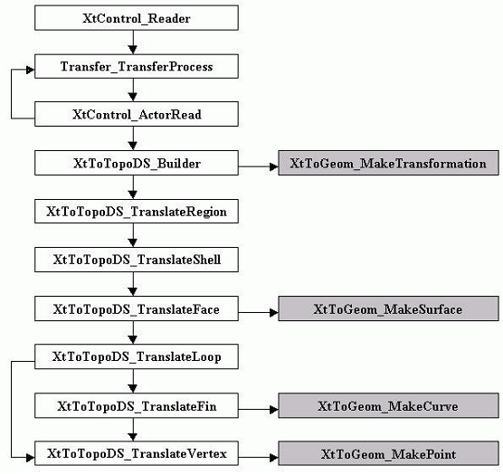

#     Parasolid Interface User's Guide 

<h1><a id="products_user_guides__parasolid_interface_1">Introduction</a></h1>

<h2><a id="products_user_guides__parasolid_interface_1_1">Overview</a></h2>

<h3><a id="products_user_guides__parasolid_interface_1_1_1">This manual</a></h3>

This manual provides technical documentation on the OPEN CASCADE Parasolid interface and explains how to use this interface for reading Parasolid X_T and X_B files from within Open CASCADE Technology based software.

X_T and X_B files in all format versions (called schemes) can be read.

The interface offers two levels of Parasolid data support:

* The _basic interface_ supports only geometrical and topological Parasolid entities that are translated to Open CASCADE Technology shapes.
* The _XDE interface_ extends the basic interface with translation of attributes (colors and names, and assembly structures) attached to entities, to XDE data structures.

The interface loads all data from a Parasolid file including data that cannot be translated. During the translation process, the interface finds and translates entities that have correspondence in Open CASCADE Technology representation.

<h3><a id="products_user_guides__parasolid_interface_1_1_2">Reference documentation</a></h3>

It is not the purpose of this manual to document the file format that will be converted to the representation used by Open CASCADE Technology. Information on this file format is only provided insofar as necessary to explain the actual operations of the interface.

For more information on the Parasolid files format, consult the appropriate external documentation.

<h3><a id="products_user_guides__parasolid_interface_1_1_3">What the Parasolid Interface does</a></h3>

The Parasolid Interface provides tools for reading of geometrical and topological data from X_T and X_B files to Open CASCADE Technology native BRep models (known as shapes). It also supports attributes (names, colors and assembly structure) that can be translated to Open CASCADE Technology using XDE.

The Parasolid Interface provides high level of data exchange quality through the use of Shape Healing which corrects shapes after translation. The user of the interface benefits from the standard data exchange features of Open CASCADE Technology: file analysis, checking the transfer result, total or partial transfer, and use of attributes (with XDE).

For information on Shape Healing and XDE, see the _Shape Healing User’s Guide_ and the _XDE User’s Guide_ available within Open CASCADE Technology.

<h2><a id="products_user_guides__parasolid_interface_1_2">Testing with Draw</a></h2>

The standard DRAWEXE executable from Open CASCADE Technology can be used for testing the Parasolid Interface. The plugin library TKXSDRAWXT provides specific commands for reading Parasolid files.

For more information on standard DRAW commands, see the _Test Harness User’s Guide_ available within Open CASCADE Technology.

For more information on testing Parasolid interface with Draw see the [Draw commands interface](#products_user_guides__parasolid_interface_3).

<h1><a id="products_user_guides__parasolid_interface_2">Reading Parasolid files</a></h1>

<h2><a id="products_user_guides__parasolid_interface_2_1">Overview</a></h2>

This chapter explains what is read from Parasolid files, how it is done and the methods available to get the most out of the process.

<h2><a id="products_user_guides__parasolid_interface_2_2">Domains covered</a></h2>

The following kinds of entities can be read from Parasolid files:

* Points
* Curves
* Surfaces
* Topological entities
* Assembly structures
* Transformation matrices

For more information, see the chapter [Mapping Parasolid entities to OCCT shapes](#products_user_guides__parasolid_interface_4_2).

**Note:** Name and color attributes attached to topological entities are translated to XDE data structures. Other attributes are just loaded but not translated. For more information on using XDE for reading, refer to the chapter [Reading with XDE](#products_user_guides__parasolid_interface_2_4).

<h2><a id="products_user_guides__parasolid_interface_2_3">General procedure</a></h2>

You can translate a Parasolid file to Open CASCADE Technology shapes as follows:

1. Load the file.
2. Check the file consistency (optional).
3. Set the translation parameters.
4. Perform the file translation.
5. Retrieve the results.

The following sections explain how this is done and what resources to use.

<h3><a id="products_user_guides__parasolid_interface_2_3_1">Loading a Parasolid file</a></h3>

Load a Parasolid file as follows:

~~~{.cpp}
   XtControl_Reader aReader;
   IFSelect_ReturnStatus stat = aReader.ReadFile("MyFile.x_t");
~~~

Loading the file just places the data into memory, no translation actually occurs.

**For advanced users**

As soon as a Parasolid file is loaded into memory, the Parasolid model can be accessed for querying. Obtain the Parasolid model as follows:

~~~{.cpp}
   Handle(XtData_Model) aModel =
   XtData_Model::DownCast(aReader.WS()->Model());
~~~

This model can then be queried to get the number of entities, to iterate and access entities, etc. For more information, refer to the description of the class Interface_InterfaceModel in the Open CASCADE Technology documentation.

<h3><a id="products_user_guides__parasolid_interface_2_3_2">Checking a Parasolid file</a></h3>

Since Parasolid files contain no delimiters, misreading just one item can ruin the entire file reading process.

<h3><a id="products_user_guides__parasolid_interface_2_3_3">Setting the translation parameters</a></h3>

You can set translation parameters within the program or via the resource file.

You can use the methods provided by the class `Interface_Static` to query and set the translation parameters within the program. For example:

Read the parameter **read.precision.val** as follows:

~~~{.cpp}
   Standard_Real rp =
   Interface_Static::RVal("read.precision.val");
~~~

Modify this parameter **read.precision.val** as follows:

~~~{.cpp}
   if (!Interface_Static::SetRVal ("read.precision.val",0.001))
   { /* error */; }
~~~

When you set the translation parameters, remember that if you provide a value for translation parameters outside the range of possible values, the parameter is ignored.

To read shapes from a Parasolid file, the following interface parameters are available:

<table>
  <tr>
    <th align="center">Name</th>
    <th align="center">Description</th>
  </tr>
  <tr>
    <td>read.encoderegularity.angle</td>
    <td>Defines an angle used for coding the regularity of edges in the shape</td>
  </tr>
  <tr>
    <td>read.maxprecision.mode</td>
    <td>If 1 (Forced), maximal tolerance is the rigid limit. If 0 (Preferred), maximal tolerance is the limit but can be exceeded by some algorithms.</td>
  </tr>
  <tr>
    <td>read.maxprecision.val</td>
    <td>Value of maximal precision (used if previous parameter is 1)</td>
  </tr>
  <tr>
    <td>read.precision.mode</td>
    <td>Precision for input entities. If 0 (File), precision from the file is used for the loaded shapes. If 1 (Session), the value of the following parameter is used.</td>
  </tr>
  <tr>
    <td>read.precision.val</td>
    <td>Value of precision (used if previous parameter is 1)</td>
  </tr>
  <tr>
    <td>read.stdsameparameter.mode</td>
    <td>The same parameter check will not be done if this flag is 0 (Off).</td>
  </tr>
  <tr>
    <td>read.surfacecurve.mode</td>
    <td>Parametric curves will not be read if this flag is 0 (Off).</td>
  </tr>
  <tr>
    <td>read.xt.resource.name</td>
    <td>The name of the resource file for shape processing performed after translation.</td>
  </tr>
  <tr>
    <td>read.xt.sequence</td>
    <td>Prefix of parameters in the resource file for shape processing performed after translation.</td>
  </tr>
</table>

<h3><a id="products_user_guides__parasolid_interface_2_3_4">Performing the translation</a></h3>

Perform the translation according to what you want to translate. You can choose either root entities or select any entity by its number in the Parasolid file. There are limited sets of types of entities that can be used as starting entities for translation.

Only the following entities are recognized as transferable:

* XtTopoDS_Assembly
* XtTopoDS_Body
* XtAttributes_PointerLisBlock

Select the entities you want to translate and then perform their translation.

**Select the entities to translate**

You can select either:

* the entire file,
* a list of entities,
* a single entity.

**The entire file**

Transferring a whole file means transferring all root entities.

Evaluate the number of roots after loading the file and before translation as follows:

~~~{.cpp}
   Standard_Integer nbRoots = aReader.NbRootsForTransfer();
~~~

Translate a single root entity identified by its rank with:

~~~{.cpp}
   Standard_Boolean ok = aReader.TransferOneRoot(rank);
~~~

Perform the translation of all root entities as follows:

~~~{.cpp}
   Standard_Integer num = aReader.TransferRoots();
~~~

**A list of entities**

A list of entities can be formed with help of XtControl_Reader::GiveList() method.

For example, to form a list containing entities with sequence numbers 1, 2 and 3:

~~~{.cpp}
   Handle(TColStd_HSequenceOfTransient) list =
   aReader.GiveList("(-1,-2,-3)");
~~~

The result is a `TColStd_HSequenceOfTransient`.

You can either translate a list of entities all at once or one at a time. Translating entities one at a time lets you check the validity of each translated entity.

Translate a list of entities all at once as follows:

~~~{.cpp}
   Standard_Integer nbtrans = aReader.TransferList(list);
~~~

where `nbtrans` gives the number of items in the list that produced a shape.

Translate a list of entities one at a time as follows:

~~~{.cpp}
   Standard_Integer i, nb = list->Length();
   for (i = 1; i <= nb; i ++)
   {
     Standard_Boolean OK = aReader.TransferEntity(list->Value(i));
   }
~~~

**Selections**

There are several predefined selections that can be used to create lists:

<table>
  <tr>
    <th align="center">Selection</th>
    <th align="center">Selects all</th>
  </tr>
  <tr>
    <td>xst-model-all</td>
    <td>Entities</td>
  </tr>
  <tr>
    <td>xst-model-roots</td>
    <td>Roots</td>
  </tr>
  <tr>
    <td>xst-transferable-all</td>
    <td>Translatable entities</td>
  </tr>
  <tr>
    <td>xst-transferrable-roots</td>
    <td>Translatable roots (default). Refer to chapter [Mapping Parasolid entities to OCCT shapes](#products_user_guides__parasolid_interface_4_2) for more information on which Parasolid entities can be translated.</td>
  </tr>
  <tr>
    <td>xst-sharing + &lt;selection&gt;</td>
    <td>Entities sharing at least one entity selected by &lt;selection&gt;.</td>
  </tr>
  <tr>
    <td>xst-shared + &lt;selection&gt;</td>
    <td>Entities shared by at least one entity selected by &lt;selection&gt;.</td>
  </tr>
</table>

By default (no arguments), `XtControl_Reader::GiveList()` returns a list of all roots.

**Selection by rank**

Select an entity by its rank as follows:

~~~{.cpp}
   Standard_Boolean ok = aReader.TransferOne(rank);
~~~

where `<rank>` is a number of the entity.

The method returns `Standard_True` to indicate that an entity has been translated.

**Direct selection of an entity**

The argument is a `Handle(Standard_Transient)` pointing to an entity.

~~~{.cpp}
   Standard_Boolean ok = aReader.TransferEntity(ent);
~~~

The method returns `Standard_True` to indicate that an entity has been translated.

**Translate the selected entities**

Translate an entity identified by its rank in the model as follows:

~~~{.cpp}
   Standard_Boolean ok = aReader.TransferOne(rank);
~~~

Translate an entity identified by its handle as follows:

~~~{.cpp}
   Standard_Boolean ok = aReader.TransferEntity(ent);
~~~

Translate a list of entities in one operation as follows:

~~~{.cpp}
   Standard_Integer nbtrans = aReader.TransferList(list);
~~~

Translate a list of entities, entity by entity, as follows:

~~~{.cpp}
   Standard_Integer i, nb = list->Length();
   for (i = 1; i <= nb; i ++)
   {
     Standard_Boolean OK = aReader.TransferEntity(list->Value(i));
   }
~~~

<h3><a id="products_user_guides__parasolid_interface_2_3_5">Getting the translation results</a></h3>

Each successful translation operation outputs one shape. A series of translations gives a series of shapes.

Each time you invoke `TransferOne`, `TransferEntity` or `TransferList`, their results are accumulated and the counter returned by `NbShapes()` method increases.

You can clear the results between two translation operations with:

~~~{.cpp}
   aReader.ClearShapes();
~~~

If you do not, the results from the next translation will be added to the accumulation.
`TransferRoots` operations automatically clear all existing results before they start.

Get the number of shapes recorded in the result as follows:

~~~{.cpp}
   Standard_Integer nbs = aReader.NbShapes();
~~~

Get the result \<num\> (\<num\> is an integer between 1 and NbShapes), as follows:

~~~{.cpp}
   TopoDS_Shape shape = aReader.Shape(num);
~~~

Get the first result in a translation operation as follows:

~~~{.cpp}
   TopoDS_Shape shape = aReader.Shape();
~~~

Get all the results in a single shape as follows:

~~~{.cpp}
   TopoDS_Shape shape = aReader.OneShape();
~~~

The shape can be:

* a null shape if there are no results,
* in the case of a single result, a shape that is specific to that result,
* a compound that contains the results if there are several results.

<h3><a id="products_user_guides__parasolid_interface_2_3_6">Checking that translation was correctly performed</a></h3>

Each time you invoke `TransferOneRoot` or `TransferRoots`, you can display the related messages as follows:

~~~{.cpp}
   aReader.PrintCheckTransfer (failsonly, mode);
~~~

This check concerns only the last invocation of `TransferOneRoot` or `TransferRoots`.

<h3><a id="products_user_guides__parasolid_interface_2_3_7">Translation messages</a></h3>

It is possible to print or display messages that concern the normal functioning of the processor (transfer, loading, etc).

Class `Message_Messenger` manages processing of messages. A unique static instance of this class can be accessed as follows:

~~~{.cpp}
   const Handle(Message_Messenger) &aMsgr =
   Message::DefaultMessenger();
~~~

The `Message_Messenger` class outputs messages to so called "printers". To output messages to a file it is possible to use class `Message_PrinterOStream` as follows:

~~~{.cpp}
   Handle(Message_PrinterOStream) aPrinter = new
   Message_PrinterOStream("logfile",Standard_False,Gravity);
~~~

To output messages to standard output (cout) use it as follows:

~~~{.cpp}
   Handle(Message_PrinterOStream) aPrinter = new
   Message_PrinterOStream(Gravity);
~~~

where Gravity is `Message_Gravity` representing the level of message to be output.

The created printer can be added to `Message_Messenger` as follows:

~~~{.cpp}
   aMsgr->AddPrinter(aPrinter);
~~~

The root class `XSControl_Reader` provides to `SatControl_Reader` the following methods to print messages associated to the entities during loading and translation:

~~~{.cpp}
   XSControl_Reader::PrintCheckLoad(failsonly,mode)
   XSContriol_Reader::PrintCheckTransfer(failsonly,mode)
~~~

where `failsonly` set to True enables printing of fails only messages, or all messages if set to False, and mode determines the contents and the order of the messages according to the terms of the `IFSelect_PrintCount` enumeration.

<h3><a id="products_user_guides__parasolid_interface_2_3_8">Tolerance management</a></h3>

The values of tolerances in shapes evolve during transfer from Parasolid to Open CASCADE Technology. The initial value of tolerance in most cases is set to Precision::Confusion(). In particular, all faces and edges are constructed with default tolerance Precision::Confusion(). Tolerance of edges can be modified later by:

* ShapeFix::SameParameter() if the tolerance of edge shows real deviation between 3D curve and pcurves.
* ShapeFix_Wire::FixSelfIntersection() in case if the pcurve of self-intersecting edge is modified.

The vertices which are at the ends of the edges translated from Parasolid curves are created with initial tolerance value set in the interface by means of a static parameter. The vertices which are at the ends of the edges within shapes are created with the default tolerance Precision::Confusion(). Tolerance of vertices can be modified later by:

* ShapeFix::SameParameter()
* ShapeFix_Wire::FixSelfIntersection()
* ShapeFix_Wire::FixLacking()
* ShapeFix_Wire::Connected()

As a result, the final tolerance of sub-shapes shows the real quality of the local geometry of shapes (distance between ends of adjacent edges, deviation of edges’ 3D curves and their parametric curves, and so on).

<h3><a id="products_user_guides__parasolid_interface_2_3_9">Setting Shape Processing parameters</a></h3>

The last phase of translation of a Parasolid file to Open CASCADE Technology shapes is Shape Processing: a sequence of operations can be applied to the produced shape, to correct problems and adapt it for further use.

The sequence of Shape Processing operations and their parameters are defined in a resource file whose name is given by the interface parameter **read.xt.resource.name** (the default value is <b>"XT"</b>).

The sample resource file is provided in the resource unit `XSTEPResourceAdv`. The environment variable with the corresponding name `CSF_XTDefaults` should point to the directory where that file is located.

The sequence whose name is given by the interface parameter **read.xt.sequence** (the default value is <b>"FromXT"</b>) is used. If a resource file is not found, the default sequence containing the single operator `FixShape` with default parameters is applied.

<h2><a id="products_user_guides__parasolid_interface_2_4">Reading with XDE</a></h2>

You can use XDE to read colors, names, and assemblies. When using XDE, the standard process of reading a Parasolid file is extended by steps ensuring the correct interpretation of these attributes.

<h3><a id="products_user_guides__parasolid_interface_2_4_1">Loading a Parasolid file</a></h3>

Load a Parasolid file as follows:

~~~{.cpp}
   XtCAFControl_Reader aReader;
   IFSelect_ReturnStatus stat = aReader.ReadFile("MyFile.x_t");
~~~

Loading the file just places the data into memory, no translation actually occurs.

<h3><a id="products_user_guides__parasolid_interface_2_4_2">Setting the translation parameters</a></h3>

The standard parameters are set first, see the paragraph [Setting the translation parameters\](#products_user_guides__parasolid_interface_2_3_3). Then the following additional parameters are available to control translation of attributes from Parasolid to XDE:

* For transferring colors:

~~~{.cpp}
   aReader.SetColorMode(mode);
~~~

// mode can be `Standard_True` or `Standard_False`

* For transferring names:

~~~{.cpp}
   aReader.SetNameMode(mode);
~~~

// mode can be `Standard_True` or `Standard_False`

<h3><a id="products_user_guides__parasolid_interface_2_4_3">Translating to an XDE document</a></h3>

Translate the entire file into the document as follows:

~~~{.cpp}
   Standard_Boolean ok = aReader.Transfer(doc);
~~~

where doc is a variable which contains a handle to the output document and has a type `Handle(TDocStd_Document)`.

<h2><a id="products_user_guides__parasolid_interface_2_5">Example</a></h2>

The following is an example of Parasolid file reading:

<i><b>Example</b></i>
~~~{.cpp}
   #include <XtControl_Reader.hxx>
   #include <TopoDS_Shape.hxx>
   #include <BRepTools.hxx>
   int main()
   {
    XtControl_Reader aReader;
    // Loads file MyFile.x_t
    IFSelect ReturnStatus stat = aReader.ReadFile ("MyFile.x_t");
    // Get the number of transferrable roots
    Standard_Integer num, nbroots = aReader.NbRootsForTransfer();
    cout<<"Nb Roots recognized for transfer = "<<nbroots<<endl;
    for (num = 1; num <= nbroots; num ++)
    {
     // Each Parasolid root is transferred individually
     cout<<"Processing root "<<num<<endl;
     aReader.ClearShapes();
     Standard_Boolean statone = aReader.TransferOneRoot(num);
     if (statone)
     {
      cout<<"Root "<<num<<" transferred to"<<aReader.NbShapes()
      <<"Shape(s)"<<endl;
      // Obtain the result of translation as one shape
      TopoDS_Shape sh = aReader.OneShape();
      if (sh.IsNull()) { cout<<"No result"<<endl; continue; }
     }
     else
     {
      cout<<"Root "<<num<<" not transferred"<<endl;
      continue;
     }
    }
    // Another way: all roots at once
    Standard_Integer nb = aReader.TransferRoots();
    return 0;
   }
~~~

<h1><a id="products_user_guides__parasolid_interface_3">Draw commands interface</a></h1>

<h2><a id="products_user_guides__parasolid_interface_3_1">Overview</a></h2>

This manual explains how to use Draw Test Harness (DRAWEXE) executable for testing OPEN CASCADE Parasolid Interface interactively in Draw environment. It describes a set of Draw commands specific to data exchange tasks, which allow loading and writing of data files and analysis of the resulting data structures and shapes.

**NOTE:** In the description of the commands, square brackets ([ ]) are used to indicate optional parameters. Parameters given in the angle brackets (< >) and numbers (#) are to be substituted with the appropriate values. When several exclusive variants are possible, vertical dash (|) is used.

<h2><a id="products_user_guides__parasolid_interface_3_2">General description</a></h2>

<h3><a id="products_user_guides__parasolid_interface_3_2_1">Loading plugin commands</a></h3>

A set of commands to work with Data Exchange interfaces can be loaded in Draw as follows:

~~~{.cpp}
   Draw[] pload DATAEXCHANGE
~~~

A set of commands to work with Parasolid interface in particular can be loaded in Draw as follows:

~~~{.cpp}
   Draw[] pload –DrawPluginProducts PARASOLID
~~~

<h3><a id="products_user_guides__parasolid_interface_3_2_2">Setting interface parameters</a></h3>

A set of parameters for Data Exchange interfaces is defined in XSTEP component of Open CASCADE Technology. In Draw, view or change these parameters as follows:

~~~{.cpp}
   param [<parameter_name> [<value>]]
~~~

The **param** command with no arguments gives a list of all parameters with their values. When the argument \<parameter_name\> is specified, information about this parameter is printed (current value and short description). The third argument is used to set a new value of the given parameter. The result of the setting is printed immediately.

In all interface operations, the process protocol (fail and warning messages, mapping of the loaded entities into the Open CASCADE Technology shapes, etc.) can be written to the trace file. Two parameters are defined in the Draw session: trace level (integer value from 0 to 9, default is 0), and trace file (default is standard output).

To view and change these parameters, use **xtrace** command.

Print current settings (for example: 'Level=1 - Standard Output') as follows:

~~~{.cpp}
   xtrace
~~~

Set the trace level to <value> as follows:

~~~{.cpp}
   xtrace <value>
~~~

Set the trace file as **tracefile.log** as follows:

~~~{.cpp}
   xtrace tracefile.log
~~~

Direct all messages to the standard output as follows:

~~~{.cpp}
   xtrace
~~~

<h3><a id="products_user_guides__parasolid_interface_3_2_3">Reading Parasolid files</a></h3>

Read a Parasolid file as follows:

~~~{.cpp}
   xtread <file_name> <result_shape_name> [<entity> ...]
~~~

Where entity can be defined by a number in the:

* File using sign '-' or '$' with number (identifies an entity by its sequence number in the file).
* File using letter 'l' or 'L' with number (identifies an entity by its line number in the file).
* Number in the model using number only.

You can define all roots by using sign '*'.

To transfer entities from the last loaded model use "." instead of the file name.

<h3><a id="products_user_guides__parasolid_interface_3_2_4">Analyzing the transferred data</a></h3>

Retrieve general statistics on the loaded data as follows:

~~~{.cpp}
   data <symbol>
~~~

The information printed by this command depends on the specified symbol:

<table>
  <tr>
    <th align="center">Symbol</th>
    <th align="center">Result</th>
  </tr>
  <tr>
    <td><b>g</b></td>
    <td>Prints information contained in the header of the file.</td>
  </tr>
  <tr>
    <td><b>c</b> or <b>f</b></td>
    <td>Runs check procedure of the integrity of the loaded data and prints resulting statistics (<b>f</b> works only with fails while <b>c</b> with both fail and warning messages)</td>
  </tr>
  <tr>
    <td><b>t</b></td>
    <td>The same like <b>c</b> or <b>f</b>, with list of failed or warned entities</td>
  </tr>
  <tr>
    <td><b>m</b> or <b>l</b></td>
    <td>The same as <b>t</b> but prints also a status for each entity</td>
  </tr>
  <tr>
    <td><b>e</b></td>
    <td>Lists all entities of the model with their numbers, types, status of validity etc.</td>
  </tr>
  <tr>
    <td><b>r</b></td>
    <td>The same like <b>e</b> but lists only root entities</td>
  </tr>
</table>

A set of special objects are used to operate with the loaded model. They can be of the following types:

<table>
  <tr>
    <th align="center">Special object type</th>
    <th align="center">Operation</th>
  </tr>
  <tr>
    <td>Selection</td>
    <td>Filters - allow to select subsets of entities of the loaded model</td>
  </tr>
  <tr>
    <td>Counters</td>
    <td>Calculate some statistics on the model data</td>
  </tr>
</table>

Print a list of objects defined in the current session as follows:

~~~{.cpp}
   listitems
~~~

**NOTE:** In the following commands, if several \<selection\> arguments are specified, the results of each following selection are applied to its preceding command:

Print a list of loaded entities defined by the selection argument as follows:

~~~{.cpp}
   givelist <selection_name> [<selection_name>]
~~~

Print a number of loaded entities defined by selection argument as follows:

~~~{.cpp}
   givecount <selection_name> [<selection_name>]
~~~

Calculate and print statistics on the entities in the model using the following commands:

Print only a number of entities per each type matching the criteria defined by arguments as follows:

~~~{.cpp}
   count <counter> [<selection> ...]
~~~

Print the total number of entities of all types matching the criteria defined by arguments with the biggest number corresponding to one type as follows:

~~~{.cpp}
   sumcount <counter> [<selection> ...]
~~~

Print a list of entities for each type matching the criteria defined by the arguments as follows:

~~~{.cpp}
   listcount <counter> [<selection> ...]
~~~

The optional \<selection\> argument, if specified, defines a subset of the entities which are to be taken into account.

The argument \<counter\> is one of the currently defined counters:

<table>
  <tr>
    <th align="center">Counter</th>
    <th align="center">Operation</th>
  </tr>
  <tr>
    <td>xst-types</td>
    <td>Calculates how many entities of each OCCT type exist</td>
  </tr>
</table>

List the entity types which were encountered in the last loaded file (with number of Parasolid entities of each type) as follows:

~~~{.cpp}
   listtypes <selection_name> ...
~~~

The list only shows a subset of all the entities. This subset is defined by the optional selection argument.

Get information on Open CASCADE Technology shape contents as follows:

~~~{.cpp}
   statshape <shape_name>
~~~

It outputs the count of each kind of subshape (vertex, edge, wire, etc.) in the shape.

**NOTE:** The number of faces is returned as a number of references. To obtain the number of single instances, use **nbshapes** command (from MODELING plugin).

Get the entity from which the shape is produced as follows:

~~~{.cpp}
   fromshape <shape_name>
~~~

Use "estatus" and "entity" to get information about the entity as follows:

~~~{.cpp}
   entity <entity> <level>
~~~

Where entity is defined by a:

* number in the file using sign '-' or '#' with number.
* line number in the file using letter 'l' or 'L' with number. Number in the model using number only.
* subtype of the entity using letter 'r' with the subtype number.

and where level is an integer value from 0 to 3:

<table>
  <tr>
    <th align="center">Level value</th>
    <th align="center">Description</th>
  </tr>
  <tr>
    <td>0</td>
    <td>Displays only entity type</td>
  </tr>
  <tr>
    <td>1</td>
    <td>Displays entity type, sequence number and line number</td>
  </tr>
  <tr>
    <td>2</td>
    <td>Displays entity type, sequence number, line number and dump of entity data</td>
  </tr>
  <tr>
    <td>3</td>
    <td>Displays entity type, sequence number, line number and dump of entity data with expanding subtypes.</td>
  </tr>
</table>

Analyze the internal correctness of the shape as follows:

~~~{.cpp}
   checkshape <shape_name>
~~~

This checks the geometry and topology of the shape for different types of inconsistencies, like self-intersecting wires or incorrect orientation of trimming contours. If an error is found, erroneous parts of the shape are copied with the names `"faulty_#"` and an appropriate message is generated.

To explode the shape and calculate minimum, average and maximum tolerances of it, proceed as follows:

~~~{.cpp}
   tolerance <shape_name> [<min> [<max>] [<symbol>]]
~~~

You get the maximum, average and minimum values of tolerances for each kind of sub-shape having tolerances and also on the whole shape.

When specifying \<min\> and \<max\> arguments, this command outputs shapes with names \<shape_name\>_... and their total number with tolerances in the range [min, max].

\<Symbol\> is used for specifying the kinds of sub-shapes to be analyzed: v - for vertices, e - for edges, f - for faces, c - for shells and faces.

<h3><a id="products_user_guides__parasolid_interface_3_2_5">Index of useful commands</a></h3>

<table>
  <tr>
    <th align="center">Command</th>
    <th align="center">Description</th>
  </tr>
  <tr>
    <td colspan="2">
      <b>Setting general parameters</b>
    </td>
  </tr>
  <tr>
    <td>xtrace [#|&lt;file&gt;|.]</td>
    <td>View and set parameters of the trace file</td>
  </tr>
  <tr>
    <td>param [&lt;param&gt; [&lt;val&gt;]]</td>
    <td>View and set parameters of transfer</td>
  </tr>
  <tr>
    <td colspan="2">
      <b>Reading and writing Parasolid file</b>
    </td>
  </tr>
  <tr>
    <td>xload &lt;file&gt;</td>
    <td>Loads entities from the file into memory</td>
  </tr>
  <tr>
    <td>xtread {&lt;file&gt;} &lt;name&gt;</td>
    <td>Translates a Parasolid file into shape</td>
  </tr>
  <tr>
    <td colspan="2">
      <b>Checking the results of the load procedure</b>
    </td>
  </tr>
  <tr>
    <td>data &lt;symbol&gt;</td>
    <td>Gets statistics on the loaded file</td>
  </tr>
  <tr>
    <td>listitems</td>
    <td>Gets list of all defined special objects like selec­tions and counters</td>
  </tr>
  <tr>
    <td>count &lt;counter&gt; [&lt;selection&gt;]</td>
    <td>Counts entities by counter</td>
  </tr>
  <tr>
    <td>listcount &lt;counter&gt; [&lt;selection&gt;]</td>
    <td>Counts entities by counter and list them</td>
  </tr>
  <tr>
    <td>givelist &lt;selection&gt;</td>
    <td>Gets list of subset of loaded entities defined by selection</td>
  </tr>
  <tr>
    <td>listtypes [&lt;selection&gt;]</td>
    <td>Gets statistics on the types of the entities loaded</td>
  </tr>
  <tr>
    <td>entity &lt;entity&gt; &lt;level&gt;</td>
    <td>Gets information about entities</td>
  </tr>
  <tr>
    <td>estatus</td>
    <td>Gets information about super- and sub- entities.</td>
  </tr>
  <tr>
    <td colspan="2">
      <b>Analyzing of the loaded shapes</b>
    </td>
  </tr>
  <tr>
    <td>checkshape &lt;shape&gt;</td>
    <td>Checks shape for internal errors</td>
  </tr>
  <tr>
    <td>statshape &lt;shape&gt;</td>
    <td>Gets statistics on the shape</td>
  </tr>
  <tr>
    <td>tolerance &lt;shape&gt;</td>
    <td>Calculates tolerances for the given shape</td>
  </tr>
</table>

<h2><a id="products_user_guides__parasolid_interface_3_3">BRep level commands</a></h2>

These commands are useful for translation of Parasolid models to OCCT shapes.

<h3><a id="products_user_guides__parasolid_interface_3_3_1">xtread</a></h3>

Purpose: Reads a Parasolid file to an OCCT shape.

Syntax:  xtread \<file_name\> \<result_shape_name\> [\<entity\>]

Where:

* \<file_name\> is a name of file for loading;
* \<result_shape_name\> is a name of resulting shape;
* \<entity\> is an auxiliary parameter. If \<entity\> is omitted all roots will be translated as a set of shapes. If parameter \<entity\> is used as a number only the corresponding entity will be translated. If we use symbol ‘*’ as \<entity\> all roots will be translated as one compound.

<i><b>Example</b></i>
~~~{.cpp}
   # translate all roots from file to the shape "a"
   xtread D:/files/model.x_t a *
~~~

<h3><a id="products_user_guides__parasolid_interface_3_3_2">testreadxt</a></h3>

Purpose: Reads a Parasolid file to an OCCT shape (simplified).

Syntax: testreadxt \<file_name\> \<result_shape_name\>

Where:

* \<file_name\> is a name of file for reading;
* \<result_shape_name\> is a name of resulting shape.

<i><b>Example</b></i>
~~~{.cpp}
   # translate all roots from file to the shape "a"
   testreadxt D:/files/model.x_t a
~~~

<h3><a id="products_user_guides__parasolid_interface_3_3_3">geomfillpipe</a></h3>

Purpose: It is an auxiliary command. Makes a pipe by 3 curves and radius.

Syntax: geomfillpipe \<result\> \<path\> \<radius\> \<curve1\> \<curve2\>

Where:

* \<result\> is a name of resulting surface;
* \<path\> is a name of the curve used as the path;
* \<radius\> is a value of the radius;
* \<curve1\> is a name of the first curve;
* \<curve2\> is a name of the second curve.

<i><b>Example</b></i>
~~~{.cpp}
   # make a pipe by 3 curves and radius
   geomfillpipe res c1 20 c2 c3
~~~

<h3><a id="products_user_guides__parasolid_interface_3_3_4">buildC3dFromC2d</a></h3>

Purpose: It is an auxiliary command. Makes a 3d curve from a 2d curve and surface.

Syntax: buildC3dFromC2d \<result\> \<curve2d\> \<surface\> [\<toler\>]

Where:

* \<result\> is a name of resulting curve;
* \<curve2d\> is a name of 2d curve;
* \<surface\> is a name of the surface;
* \<toler\> is a value of tolerance. If \<toler\> is omitted the default value will be used.

<i><b>Example</b></i>
~~~{.cpp}
   # make a 3d curve from a 2d curve and surface
   buildC3dFromC2d res c2d surf
~~~

<h3><a id="products_user_guides__parasolid_interface_3_3_5">scaleSurfParamsbyV</a></h3>

Purpose: It is an auxiliary command. Re-scales parameters of all surfaces from a given shape.

Syntax: scaleSurfParamsbyV \<shape\> \<scale\> \<byV[1\0]\>

Where:

* \<shape\> is a name of resulting surface;
* \<scale\> is a scale;
* \<byV\> is a special parameter. If byV is equal to 1 – scales by V parameter, otherwise – by U parameter.

<i><b>Example</b></i>
~~~{.cpp}
   # re-scales parameters of surfaces by V
   scaleSurfParamsbyV a 0.5 1
~~~

<h2><a id="products_user_guides__parasolid_interface_3_4">XDE level commands</a></h2>

<h3><a id="products_user_guides__parasolid_interface_3_4_1">ReadXt</a></h3>

Purpose: Reads a Parasolid file to an XCAF document.

Syntax: ReadXt \<doc_name\> \<file_name\>

Where:

* \<file_name\> is a name of file for reading;
* \<doc_name\> is a name of resulting XCAF document

<i><b>Example</b></i>
~~~{.cpp}
   # translate all roots from file to the document "D1"
   ReadXt D D:/files/model.x_t
~~~

<h1><a id="products_user_guides__parasolid_interface_4">Appendix</a></h1>

<h2><a id="products_user_guides__parasolid_interface_4_1">Packaging</a></h2>

<h3><a id="products_user_guides__parasolid_interface_4_1_1">API classes of the Parasolid Interface</a></h3>

**The XtControl_Controller class**

This class performs all necessary initializations to use the Parasolid norm.

**The XtControl_Reader class**

This class translates Parasolid entities into Open CASCADE Technology shapes.

**The XtData_Object class**

This class is a root class for all Parasolid entity classes.

**The XtData_Model class**

This class represents a Parasolid file in the memory and provides access to Parasolid entities specified by rank number. This class can be used to consult and modify a Parasolid file before translation.

**The XtCAFControl_Reader class**

This class translates Parasolid entities into Open CASCADE Technology XCAF documents.

<h2><a id="products_user_guides__parasolid_interface_4_2">Mapping Parasolid entities to OCCT shapes</a></h2>

This chapter contains tables showing how the interface converts Parasolid entities to Open CASCADE Technology objects.

**NOTE:** Parasolid entity types that are not listed in the following tables are not translated.

<h3><a id="products_user_guides__parasolid_interface_4_2_1">Geometrical entities</a></h3>

<table>
  <tr>
    <th align="center">Parasolid entity type</th>
    <th align="center">Open CASCADE Technology object</th>
  </tr>
  <tr>
    <td><b>Points</b></td>
    <td> </td>
  </tr>
  <tr>
    <td>29 : Point</td>
    <td>gp_Pnt</td>
  </tr>
  <tr>
    <td><b>Curves</b></td>
    <td> </td>
  </tr>
  <tr>
    <td>30 : Line</td>
    <td>Geom_Line</td>
  </tr>
  <tr>
    <td>31 : Circle</td>
    <td>Geom_Circle</td>
  </tr>
  <tr>
    <td>32 : Ellipse</td>
    <td>Geom_Ellipse</td>
  </tr>
  <tr>
    <td>34 : Intersection</td>
    <td>Geom_BsplineCurve</td>
  </tr>
  <tr>
    <td>130 : PE_Curve</td>
    <td>- (limitation)</td>
  </tr>
  <tr>
    <td>133 : Trimmed curve</td>
    <td>Geom_TrimmedCurve</td>
  </tr>
  <tr>
    <td>134 : B_Curve</td>
    <td>Geom_BSplineCurve</td>
  </tr>
  <tr>
    <td>137 : SP_Curve</td>
    <td>Geom2d_BSplineCurve</td>
  </tr>
  <tr>
    <td><b>Surfaces</b></td>
    <td> </td>
  </tr>
  <tr>
    <td>50 : Plane</td>
    <td>Geom_Plane</td>
  </tr>
  <tr>
    <td>51 : Cylinder</td>
    <td>Geom_CylindricalSurface</td>
  </tr>
  <tr>
    <td>52 : Cone</td>
    <td>Geom_ConicalSurface</td>
  </tr>
  <tr>
    <td>53 : Sphere</td>
    <td>Geom_SphericalSurface</td>
  </tr>
  <tr>
    <td>54 : Torus</td>
    <td>Geom_ToroidalSurface</td>
  </tr>
  <tr>
    <td>56 : Blended_Edge</td>
    <td>Geom_BSplineSurface</td>
  </tr>
    <tr>
    <td>59 : Blend_Bound</td>
    <td>- (auxiliary)</td>
  </tr>
  <tr>
    <td>60 : Offset_Surf</td>
    <td>Geom_OffsetSurface</td>
  </tr>
  <tr>
    <td>67 : Swept_Surf</td>
    <td>Geom_SurfaceOfLinearExtrusion</td>
  </tr>
  <tr>
    <td>68 : Spun_Surf</td>
    <td>Geom_SurfaceOfRevolution</td>
  </tr>
  <tr>
    <td>120 : PE_Surf</td>
    <td>- (limitation)</td>
  </tr>
  <tr>
    <td>124 : B_Surface</td>
    <td>Geom_BSplineSurface</td>
  </tr>
</table>

<i><b>Parasolid Geometry description</b></i>

The package XtGeom provides representations for Parasolid geometrical entities.

<table>
  <tr>
    <th align="center">Class name</th>
    <th align="center">Represents</th>
  </tr>
  <tr>
    <td>Point</td>
    <td>Parasolid Point entity (Type 29).</td>
  </tr>
  <tr>
    <td>Line</td>
    <td>Parasolid Line entity (Type 30).</td>
  </tr>
  <tr>
    <td>Circle</td>
    <td>Parasolid Circle entity (Type 31).</td>
  </tr>
  <tr>
    <td>Ellipse</td>
    <td>Parasolid Ellipse entity (Type 32).</td>
  </tr>
  <tr>
    <td>Intersection</td>
    <td>Parasolid Intersection entity (Type 38). An intersection curve is a branch of a surface / surface intersection.</td>
  </tr>
  <tr>
    <td>PECurve</td>
    <td>Parasolid PE_Curve entity (Type 130).</td>
  </tr>
  <tr>
    <td>TrimmedCurve</td>
    <td>Parasolid Trimmed Curve entity (Type 133). A trimmed curve is a bounded region of another curve, referred to as its base curve.</td>
  </tr>
  <tr>
    <td>BCurve</td>
    <td>Parasolid B_Curve entity (Type 134).</td>
  </tr>
  <tr>
    <td>SPCurve</td>
    <td>Parasolid SP_Curve entity (Type 137). An SP curve is the 3D curve resulting from embedding a 2D curve in the parameter space of a surface. The 2D curve must be a 2D BCurve.</td>
  </tr>
  <tr>
    <td>Plane</td>
    <td>Parasolid Plane entity (Type 50).</td>
  </tr>
  <tr>
    <td>Cylinder</td>
    <td>Parasolid Cylinder entity (Type 51).</td>
  </tr>
  <tr>
    <td>Cone</td>
    <td>Parasolid Cone entity (Type 52).</td>
  </tr>
  <tr>
    <td>Sphere</td>
    <td>Parasolid Sphere entity (Type 53).</td>
  </tr>
  <tr>
    <td>Torus</td>
    <td>Parasolid Torus entity (Type 54).</td>
  </tr>
  <tr>
    <td>BlendedEdge</td>
    <td>Parasolid Blended_Edge entity (Type 56). Parasolid supports exact rolling ball blends. The spine of the rolling ball blend is the center line of the blend, specifically the path along which the center of the ball moves.</td>
  </tr>
  <tr>
    <td>BlendBound</td>
    <td>Parasolid Blend_Bound entity (Type 59). A blend_bound surface is a con¬struction surface, used to define the boundary curve where a blend becomes tangential to its supporting surface. It is an implicit surface defined internally so that it intersects one of the supporting surfaces along the boundary curve. It is orthogonal to the blend and the sup¬porting surface along this boundary curve.</td>
  </tr>
  <tr>
    <td>OffsetSurf</td>
    <td>Parasolid Offset_Surf entity (Type 60). An offset surface is the result of off¬setting a surface a certain distance along its normal, taking into account the surface sense. It inherits the parameterization of this underlying surface.</td>
  </tr>
  <tr>
    <td>SweptSurf</td>
    <td>Parasolid Swept_Surf entity (Type 67).</td>
  </tr>
  <tr>
    <td>SpunSurf</td>
    <td>Parasolid Spun_Surf entity (Type 68).</td>
  </tr>
  <tr>
    <td>PESurf</td>
    <td>Parasolid PE_Surf entity (Type 120).</td>
  </tr>
  <tr>
    <td>BSurface</td>
    <td>Parasolid B_Surface entity (Type 124).</td>
  </tr>
</table>

<h3><a id="products_user_guides__parasolid_interface_4_2_2">Topological entities</a></h3>

<table>
  <tr>
    <th align="center">Parasolid entity type</th>
    <th align="center">Open CASCADE Technology object</th>
  </tr>
  <tr>
    <td>10 : Assembly</td>
    <td>TopoDS_Compound</td>
  </tr>
  <tr>
    <td>11 : Instance</td>
    <td>TopoDS_Shape</td>
  </tr>
  <tr>
    <td>12 : Body</td>
    <td>TopoDS_Shape</td>
  </tr>
  <tr>
    <td>13 : Shell</td>
    <td>TopoDS_Shell</td>
  </tr>
  <tr>
    <td>14 : Face</td>
    <td>TopoDS_Face</td>
  </tr>
  <tr>
    <td>15 : Loop</td>
    <td>TopoDS_Wire</td>
  </tr>
  <tr>
    <td>16 : Edge</td>
    <td>TopoDS_Edge(TopoDS_Edge itself, without orientation defined by Fin)</td>
  </tr>
  <tr>
    <td>17 : Fin</td>
    <td>TopoDS_Edge</td>
  </tr>
  <tr>
    <td>18 : Vertex</td>
    <td>TopoDS_Vertex</td>
  </tr>
  <tr>
    <td>19 : Region</td>
    <td>TopoDS_Shape</td>
  </tr>
</table>

<i><b>Parasolid Topology description</b></i>

The package XtTopoDS provides representations for Parasolid topological entities.

<table>
  <tr>
    <th align="center">Class name</th>
    <th align="center">Represents</th>
  </tr>
  <tr>
    <td>Assembly</td>
    <td>Parasolid Assembly entity (Type 10). An assembly is a collection of instances of bodies or assemblies. It may also contain construction geometry.</td>
  </tr>
  <tr>
    <td>Instance</td>
    <td>Parasolid Instance entity (Type 11). An instance is a reference to a body or an assembly, with an optional transform.</td>
  </tr>
  <tr>
    <td>Body</td>
    <td>Parasolid Body entity (Type 12). A body is a collection of faces, edges and ver¬tices, together with the 3-dimensional connected regions into which space is divided by these entities. Each region is either solid or void (ind -cating whether it represents material or not).</td>
  </tr>
  <tr>
    <td>Region</td>
    <td>Parasolid Region entity (Type 19). A region is an open connected subset of 3-dimensional space whose boundary is a collection of vertices, edges, and oriented faces.</td>
  </tr>
  <tr>
    <td>Shell</td>
    <td>Parasolid Shell entity (Type 13). A shell is a connected component of the boundary of a region. As such it will be defined by a collection of faces, each used by the shell on one 'side', or on both sides; and some edges and vertices.</td>
  </tr>
  <tr>
    <td>Face</td>
    <td>Parasolid Face entity (Type 14). A face is an open finite connected subset of a surface, whose boundary is a collection of edges and vertices. It is the 2-dimensional analogy of a region.</td>
  </tr>
  <tr>
    <td>Loop</td>
    <td>Parasolid Loop entity (Type 15). A loop is a connected component of the bound¬ary of a face. It is the 2-dimensional analogy of a shell. As such it will be defined by a collection of fins and a collection of vertices.</td>
  </tr>
  <tr>
    <td>Fin</td>
    <td>Parasolid Fin entity (Type 17). A fin represents the oriented use of an edge by a loop.</td>
  </tr>
  <tr>
    <td>Edge</td>
    <td>Parasolid Edge entity (Type 16). An edge is an open finite connected subset of a curve; its boundary is a collection of zero, one or two vertices. It is the 1-dimensional analogy of a region.</td>
  </tr>
  <tr>
    <td>Vertex</td>
    <td>Parasolid Vertex entity (Type 18). A vertex represents a point in space. It is the 0-dimensional analogy of a region.</td>
  </tr>
</table>

<h3><a id="products_user_guides__parasolid_interface_4_2_3">Attributes translated to XDE</a></h3>

<table>
  <tr>
    <th align="center">Parasolid entity type</th>
    <th align="center">Open CASCADE Technology object</th>
  </tr>
  <tr>
    <td>Color</td>
    <td>XDE Color (Token 8001)</td>
  </tr>
  <tr>
    <td>Name</td>
    <td>XDE Name (Token 8017)</td>
  </tr>
</table>

<i><b>XtAttributes description</b></i>

An attribute is an entity which contains data, and which can be attached to any other entity except attributes, fins, lists, transforms or attribute definitions.

The attributes are:

* AttribDef
* AttribGroup
* Attribute
* CharValues
* IntValues
* List
* PointerLisBlock
* RealValues

<h2><a id="products_user_guides__parasolid_interface_4_3">Special cases</a></h2>

The following Parasolid entities require special computation for translation to Open CASCADE Technology:

* Intersections
* Blended

Please refer to the above chapter for more information.

<h3><a id="products_user_guides__parasolid_interface_4_3_1">Construction of the Intersection</a></h3>

An intersection curve is one of the branches of a surface-to-surface intersection. To translate it, the class  GeomInt_IntSS is used to compute the geometric representation of the intersection.

From the set of the branches, the nearest one is selected. If the intersection algorithm fails then approximation on the control points (chart) is performed. The resulting curve parameters are rebuilt according to Parasolid parameter definitions.

<h3><a id="products_user_guides__parasolid_interface_4_3_2">Construction of the Blended Edge</a></h3>

A blended Edge is an exact rolling ball blend. This surface is created using the class GeomFill_Pipe. The spine of the pipe and the two supporting curves are computed. The U and V parameters of the resulting Geom_BSplineSurface correspond to the V and U parameters of a Parasolid surface.

<h2><a id="products_user_guides__parasolid_interface_4_4">Graph of calls</a></h2>

The following diagram illustrates the structure of calls in reading Parasolid files.

| System Requirements | |
| --------- | ----------- |
| <b>Operating System</b>   | |
| Windows  | MS Windows 10 / 8 |
| Linux   | Arch Linux, CentOS 6.4, CentOS 7.3, Fedora 24, Fedora 26, Ubuntu-1804, Debian 7.0, Debian 8.0, Debian 9.0, Debian 10.0 |
| OS X/macOS | OS X/macOS 10.10 and above, x86_64 and arm64 |
| iOS | iOS 7 and above |
| Android | Android 4.2 and above |
| | |
| <b>C++</b> | |
| Windows    | Microsoft Visual Studio 2015, 2017, 2019  GCC 7.1.0 (Mingw-w64) |
| Linux      | GNU gcc 4.3 - 8.3.0 (in framework of listed above Linux OS)  LLVM Clang 3+ |     
| Mac OS X   | XCode 6 or newer |
| Android  | GCC 7.1.0+ (android-ndk-r15+) - Windows  LLVM Clang 5.0.300080+ (android-ndk-r15+) - Linux |
| | |
| <b>Library dependencies</b> | |
| Open CASCADE Technology |  Open CASCADE Technology 7.9.0  https://www.opencascade.com/content/ |
| Intel oneTBB (optional tool for multithreaded algorithms) | oneTBB 2021.5.0  https://www.threadingbuildingblocks.org/ |
